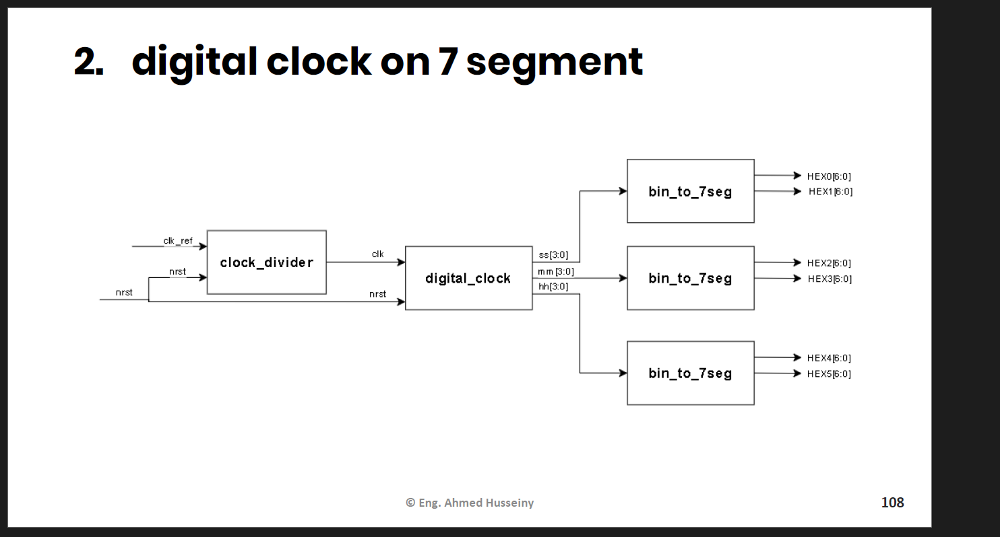

# ⏱️ Digital Clock on 7-Segment Display (FPGA - DE10-Standard)


مشروع **Digital Clock** بيتصمم بالكامل بلغة **Verilog HDL** ويتنفذ على **DE10-Standard FPGA Board** (Cyclone V)، بيعرض الوقت (ساعات : دقايق : ثواني) على 6 شاشات **7-Segment**.

الهدف من الـ repo ده مش بس عرض الكود، إنما شرح الفكرة والخطوات اللي وصلنا بيها للتصميم النهائي، عشان أي طالب هندسة بيبدأ في الـ Digital Design ياخد فايدة حقيقية.

---

## 📑 المحتويات

1. [فكرة المشروع والـ Block Diagram](#-فكرة-المشروع-والـ-block-diagram)
2. [مشكلة تحويل Binary إلى BCD](#-مشكلة-تحويل-binary-إلى-bcd)
3. [الطريقة العادية: Add-6 Correction](#-الطريقة-العادية-add-6-correction)
4. [ليه الطريقة العادية بتفشل مع الأحجام الكبيرة](#-ليه-الطريقة-العادية-بتفشل-مع-الأحجام-الكبيرة)
5. [الحل: Double Dabble Algorithm (Shift-Add-3)](#-الحل-double-dabble-algorithm-shift-add-3)
6. [شرح موديولات المشروع](#-شرح-موديولات-المشروع)
7. [الـ Clock Divider: من 50MHz لـ 1Hz](#-الـ-clock-divider-من-50mhz-لـ-1hz)
8. [الـ Pin Assignment على DE10-Standard](#-الـ-pin-assignment-على-de10-standard)
9. [هيكل الـ Repo](#-هيكل-الـ-repo)
10. [تطوير مستقبلي](#-تطوير-مستقبلي)

---

## 🧩 فكرة المشروع والـ Block Diagram

المشروع مبني على فكرة بسيطة: نظام يعد الوقت بالثواني، وكل ما يوصل لحد معين (59 ثانية، 59 دقيقة، 23 ساعة) يعمل "carry" للوحدة اللي بعده، بالظبط زي أي ساعة حائط عادية.

المخطط العام للنظام:

```
clk_ref (50MHz) ──┐
                   ▼
             ┌─────────────┐   1Hz    ┌───────────────┐
     nrst ──►│ clock_divider├────────►│ digital_clock  │
             └─────────────┘          │  (sec/min/h)   │
                                       └───────┬────────┘
                                   ss[3:0] mm[3:0] hh[3:0]
                                       │       │       │
                                       ▼       ▼       ▼
                                  bin_to_7seg (×3، وحدة لكل من الثواني/الدقايق/الساعات)
                                       │
                                       ▼
                          HEX0..HEX5 → شاشات الـ 7-Segment
```

كل وحدة زمن (ثواني/دقايق/ساعات) بتتحول من binary لـ **BCD** (رقمين عشريين منفصلين) عشان كل رقم يتبعت لشاشة 7-segment مستقلة، وده اللي هيوصلنا لموضوع المقال الأساسي.

---

## 🔢 مشكلة تحويل Binary إلى BCD

الـ counter بتاعنا (الثواني مثلاً) بيعد بصيغة **binary عادية** من 0 لـ 59، يعني القيمة 59 متخزنة كـ `111011`. المشكلة إن شاشة الـ 7-segment مش بتفهم binary، هي محتاجة **رقمين عشريين منفصلين** (5 و 9) عشان تعرض كل رقم في شاشة لوحده.

يعني احنا محتاجين نحول binary إلى **BCD (Binary Coded Decimal)**: تمثيل بيخزن كل رقم عشري (0-9) في مجموعة مستقلة من 4 بتات، بدل ما نمثل الرقم كله كـ binary واحد متصل.

---

## ➕ الطريقة العادية: Add-6 Correction

الطريقة التقليدية اللي بتتعلم في أي مقرر Digital Logic إن احنا نجمع 6 على أي نيبل (4-bit group) قيمته أكبر من 9، عشان نعوض الفرق بين الـ base اللي هي 16 (لأن 4 بتات بتاخد مدى 0-15) والـ base العشري اللي هو 10.

فكرة بسيطة: كل ما نتخطى القيمة 9 في نيبل معين، إحنا "استهلكنا" 6 قيم زيادة (10 لـ 15) مش موجودة في العد العشري، فبنضيفهم يدويًا عشان الرقم يـ"يفيض" (carry) للنيبل اللي بعده بشكل صحيح.

هي طريقة مباشرة ومفهومة، وبتشتغل تمام مع أرقام صغيرة زي اللي عندنا هنا (0-59، 0-23).

---

## ⚠️ ليه الطريقة العادية بتفشل مع الأحجام الكبيرة

المشكلة إن الطريقة دي بتعتمد على **إنك تعرف مقدمًا** فين هتحصل الفيضانات (carries) وتضيف الـ correction يدويًا لكل حالة على حدة. مع رقم من 8 بت (0-255 مثلاً)، إنت مش بس محتاج تصحح النيبل الأول، لازم تتوقع إزاي التصحيح ده هيأثر على النيبلات اللي بعده، وده بيتحول لسلسلة طويلة جدًا من الشروط والمقارنات المتشابكة (nested conditions) اللي:

- صعبة تتابعها وتتأكد إنها صح لكل قيمة ممكنة.
- مش قابلة للتعميم — كل ما زاد عدد البتات، الشجرة المنطقية بتكبر بشكل كبير (مش خطي).
- مش عملية للتنفيذ كـ hardware عام يشتغل مع أي عرض بت.

عشان كده، الحل الصناعي المعتمد هو خوارزمية **Double Dabble**.

---

## 🔄 الحل: Double Dabble Algorithm (Shift-Add-3)

فكرة الخوارزمية بسيطة وأنيقة: بدل ما نحاول نتوقع كل حالات الـ carry مقدمًا، بنعمل نفس العملية اللي بيعملها أي إنسان لما يحول binary لعشري يدويًا، بس بشكل تكراري (iterative) يصلح لأي عدد بتات.

**الخطوات:**
1. نحط الرقم الـ binary في register، وناخد جنبه مساحة فاضية (كلها أصفار) هتستقبل نواتج الـ BCD تدريجيًا.
2. **قبل كل shift**: نفحص كل نيبل من نواتج الـ BCD، ولو قيمته **≥ 5**، نضيفله **3**.
3. **نعمل shift left** بمقدار بت واحد على الـ register كله (الـ binary المتبقي + نواتج الـ BCD).
4. نكرر الخطوتين 2 و 3 بعدد بتات الـ input بالظبط (لو الـ input 8 بت، هنكرر 8 مرات).
5. في الآخر، الجزء اللي كان فاضي أصبح فيه القيمة بصيغة **BCD** جاهزة.

**ليه إضافة 3 تحديدًا؟**
لأن لما النيبل يوصل لـ 5 وبعدين يتـ shift، قيمته هتتضاعف (×2) فتوصل لـ 10 أو أكتر، وده يعني إن الرقم لازم "يفيض" للنيبل التالي. المشكلة إن الـ shift هيحول أي رقم من 5 لـ 9 (بعد الإضافة) لقيمة بين 10 و 15+3=... إضافة الـ 3 قبل الـ shift هي اللي بتضمن إن الفيضان يحصل في اللحظة والمكان الصح، وإن الباقي في النيبل يفضل رقم عشري صحيح (0-9) بعد كل خطوة.

**تطبيق الفكرة في الكود (`double_dabble.v`):**

```verilog
module shift_add3(binary,bcd);
input  wire [7:0] binary;
output wire [11:0] bcd;
reg [19:0] b_reg;
integer i;

always @(*) begin
    b_reg = {12'b0, binary};       // مساحة الـ BCD فاضية + الـ binary input
    for(i=0; i<8; i=i+1) begin     // 8 تكرارات = عدد بتات الـ input
        if (b_reg[11:8] > 4'b0100)  b_reg[11:8]  = b_reg[11:8]  + 3; // نيبل الوحدات
        if (b_reg[15:12] > 4'b0100) b_reg[15:12] = b_reg[15:12] + 3; // نيبل العشرات
        if (b_reg[19:16] > 4'b0100) b_reg[19:16] = b_reg[19:16] + 3; // نيبل المئات
        b_reg = b_reg << 1;
    end
end
assign bcd = b_reg[19:8];
endmodule
```

الميزة الأساسية: نفس الكود ده بالظبط بيشتغل صح لأي عدد بتات input، لو عايز تدعم رقم أكبر، كل اللي هتغيره هو عدد التكرارات (loop count) وعدد النيبلات، مش تعيد تصميم منطق التصحيح من الصفر.

---

## 🧱 شرح موديولات المشروع

| الموديول | الوظيفة |
|---|---|
| `Clk_Div.v` | يحول الـ reference clock (50MHz) لـ clock بمعدل 1Hz، عشان العداد يزيد كل ثانية بالظبط |
| `digital_clk.v` (`clk`) | العداد الأساسي: بيعد الثواني، ولما توصل 59 بيزود الدقايق، ولما الدقايق توصل 59 بيزود الساعات، ولما الساعات توصل 23 بترجع 0 |
| `double_dabble.v` (`shift_add3`) | يحول كل قيمة (ثواني/دقايق/ساعات) من binary إلى BCD باستخدام Double Dabble |
| `segment.v` | يحول كل رقم BCD (4 بت) إلى pattern الإضاءة المناسب لشاشة 7-segment (7 بت، active-low) |
| `B_BCD_7seg.v` | يجمع بين `shift_add3` و `segment` عشان يحول قيمة binary كاملة لشاشتين 7-segment جاهزتين للعرض |
| `digital_clk_top.v` | الموديول العلوي (top-level) اللي بيربط كل حاجة مع بعض: الـ clock divider، العداد، وكل شاشات الـ 7-segment الستة |

---

## ⏳ الـ Clock Divider: من 50MHz لـ 1Hz

الـ FPGA board بيوفر reference clock بمعدل **50MHz**، وإحنا محتاجين نبطئه لـ **1Hz** (نبضة واحدة كل ثانية) عشان العداد يزيد بشكل صحيح.

```verilog
module Clk_Div #(
    parameter INPUT_FREQ = 50_000_000,
    parameter TARGET_FREQ = 1
) (
    input      i_clk,
    input      i_rst_n,
    output reg o_clk
);
    localparam COUNTER_THRESHOLD = (INPUT_FREQ / (2 * TARGET_FREQ)) - 1;
    localparam COUNTER_WIDTH = $clog2(COUNTER_THRESHOLD + 1);
    reg [COUNTER_WIDTH-1:0] counter_r;

    always @(posedge i_clk or negedge i_rst_n) begin
        if (!i_rst_n) begin
            counter_r <= 0;
            o_clk     <= 0;
        end else if (counter_r == COUNTER_THRESHOLD) begin
            o_clk     <= ~o_clk;   // toggle كل ما نوصل للـ threshold
            counter_r <= 0;
        end else begin
            counter_r <= counter_r + 1;
        end
    end
endmodule
```

**فكرة العمل:** بنقسم على `2 × TARGET_FREQ` لأن كل **toggle واحد** بيمثل نص دورة (half period) بس، فمحتاجين toggle-ين (يعني نوصل للـ threshold مرتين) عشان نكمل موجة كاملة بمعدل 1Hz، وده بيديك في الآخر إشارة 1Hz بنسبة 50% duty cycle.

استخدام `$clog2` بيحسب عدد البتات المطلوبة للـ counter تلقائيًا حسب قيمة الـ `COUNTER_THRESHOLD`، فلو غيّرت الـ `TARGET_FREQ` أو الـ `INPUT_FREQ`، مش محتاج تحسب عرض الـ register يدويًا كل مرة.

---

## 📌 الـ Pin Assignment على DE10-Standard

ملف `constraints/pin_assignments.tcl` بيربط كل port في الـ top module بمكانه الفعلي على الـ FPGA board (Quartus assignment file):

- `clk_ref` → `PIN_AF14` (الـ 50MHz reference clock على البورد)
- `rst_n` → `PIN_AJ4` (زرار الـ reset)
- `seg_out1` إلى `seg_out6` → منافذ شاشات الـ 7-segment الست الموجودة على DE10-Standard

الملف جاهز للاستخدام المباشر مع مشروع Quartus، تقدر تستدعيه بـ:
```tcl
source "constraints/pin_assignments.tcl"
```

---

## 📂 هيكل الـ Repo

```
digital-clock-fpga/
├── rtl/
│   ├── Clk_Div.v
│   ├── digital_clk.v
│   ├── double_dabble.v
│   ├── segment.v
│   └── B_BCD_7seg.v
├── top/
│   └── digital_clk_top.v
├── constraints/
│   └── pin_assignments.tcl
├── docs/
│   └── block_diagram.png
└── README.md
```

---

## 🚀 تطوير مستقبلي

- إضافة alarm / stopwatch mode.
- دعم عرض AM/PM بدل 24-hour format.
- إضافة أزرار لضبط الوقت يدويًا (time-set mode).
- توسيع الـ Double Dabble لدعم عرض التاريخ (Date) كمان.

---

## 👤 عن المشروع

المشروع اتعمل كجزء من رحلة تعلم **Digital IC Design & FPGA**، بمشاركة كـ open-source resource لأي طالب هندسة عربي بيتعلم Verilog HDL وDigital Design.

لو عندك أي سؤال أو اقتراح تحسين، افتح Issue أو تواصل معايا مباشرة 🙌
